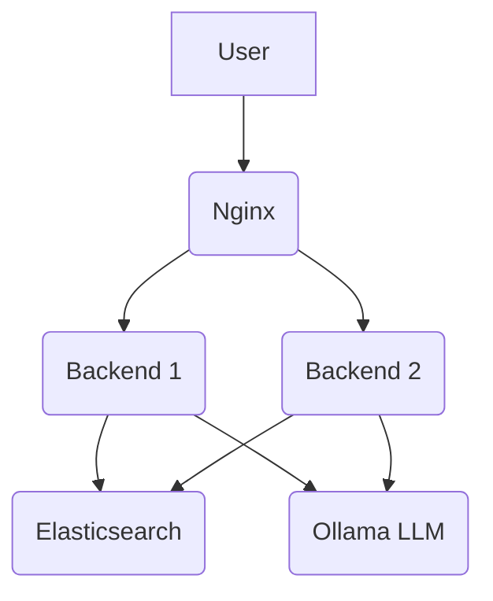

# Trendly E-commerce Agentic Communication

This project is an agentic communication system for e-commerce, It allows users to interact with a chat agent to get information about products, set alerts, and have a seamless shopping experience.

## Features

- **Conversational AI:** A chat interface where users can ask questions in natural language.
- **RAG (Retrieval-Augmented Generation):** The system uses a RAG pipeline to retrieve product information from an Elasticsearch database and generate responses using a Large Language Model (LLM).
- **Load Balancing:** The backend is load-balanced using Nginx to handle multiple concurrent users.
- **Modern UI:** The user interface is built with the Trendyol Baklava Design System to provide a familiar and intuitive user experience.
- **Fake Data Loading:** The ability to load fake product data into the system for demonstration and testing purposes.

!(UI)[Ekran görüntüsü 2025-11-01 153940.png]

## Architecture

The application is containerized using Docker and consists of the following services:

- **Nginx:** A reverse proxy and load balancer for the backend services.
- **Backend (x2):** Two instances of a FastAPI application that handles the chat logic, RAG pipeline, and communication with the LLM and Elasticsearch.
- **Elasticsearch:** A search and analytics engine used as a vector database to store and retrieve product information.



## Technologies Used

- **Backend:**
    - Python
    - FastAPI
    - LangChain
    - LangGraph
    - Ollama
    - Elasticsearch
- **Frontend:**
    - HTML
    - CSS
    - JavaScript
    - Trendyol Baklava Design System
- **Infrastructure:**
    - Docker
    - Docker Compose
    - Nginx

## Setup and Installation

1. **Prerequisites:**
    - Docker
    - Docker Compose
    - A running instance of Ollama with the `qwen3-embedding:0.6b` and `ytagalar/trendyol-llm-7b-chat-dpo-v1.0-gguf` models.

2. **Clone the repository:**
   ```bash
   git clone <repository-url>
   cd <repository-directory>
   ```

3. **Build and run the application:**
   ```bash
   docker-compose up --build -d
   ```

4. **Load the fake data:**
   ```bash
   curl -X POST http://localhost/load-data
   ```

5. **Access the application:**
   Open your web browser and navigate to `http://localhost`.

## API Endpoints

- `POST /chat`: The main endpoint for the chat interface. It takes a JSON object with a `prompt` key and returns a JSON object with a `response` key.
- `POST /load-data`: An endpoint to load the fake product data into Elasticsearch.

## UI

The user interface is a Claude-like chat screen built with the Trendyol Baklava Design System. It features:

- A header with the Trendyol logo and a badge for unread messages.
- A chat window that displays messages from the user and the agent.
- An input area with example prompt cards.
- A loading spinner and error alerts.
- A special container to highlight products found in the chat.
